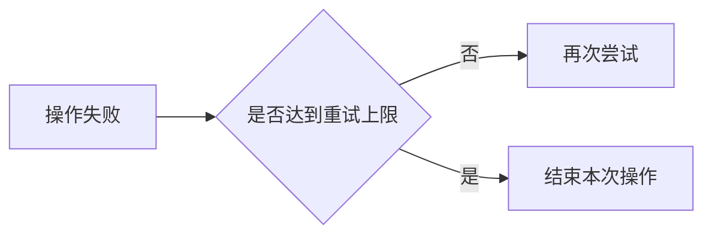

# 阶段产物、结构检查与补读

共同准备时读取本文件，后续按当前检查点执行。内置 [check_artifacts.py](../scripts/check_artifacts.py) 只读传入任务目录中的指定 Markdown，使用 Python 3 标准库，不安装依赖、不扫描用户配置，也不修改产物。

## 存放阶段内容

任务目录按 [共同准备](start.md) 确定，默认用 `work.md` 保存任务记录和阶段区块。用户指定其他 Markdown 文件名时，后续统一传入 `--file`。

每阶段实际产物放在一对独立行标记内，JSON 只占一行：

````markdown
<!-- workflow:{"run":"retry-note-1","flow":"learning","stage":1,"diagram":false} -->
## 重试计数的作用

重试计数记录同一次操作已经重新尝试的次数。达到上限后停止重试，
因此即使失败持续存在，这次操作也会结束，而不会无限占用执行机会。
本例只示范产物格式，目标项目的实际行为另按来源核对。
<!-- /workflow -->
````

四个字段必需：

| 字段 | 含义 |
| --- | --- |
| `run` | 本轮执行标识，Agent 根据任务命名；同轮各阶段一致，新一轮用新值 |
| `flow` | `learning` / `proposal` 为新文档的两个分支，各四阶段；`maintenance` / `merge` 各三阶段 |
| `stage` | 当前执行路径中的阶段编号 |
| `diagram` | 本阶段承担实际文本关系图时为 `true`，其余为 `false` |

同轮同阶段只保留一个有效区块，修订时就地更新。标记内可以使用连续正文、表格、列表、代码和图，以内容需要决定。任务目标、路径、当前停点和失效记录可以放在区块外。

已有有效材料可以复用到当前阶段，但每阶段仍要在完成当前工作后实际落盘、核对并运行检查；不能一次写完全部区块作为已分阶段执行的证明。

## 草稿与正式文档

前期区块保存已经处理的依据、解释、设计或组织决定，按需引用原始材料。完整初稿在相应后期阶段保存，维护按本次范围保存修订稿。默认草稿正文放在当前区块的草稿区，最终文章单独写入目标文档。

较长草稿确需独立编辑或用户指定独立名称时，在任务目录内使用明确命名的 Markdown 文件；阶段区块记录相对路径、草稿覆盖的内容和实际完成状态。下一阶段需要草稿时，使用其最新完整正文，缺失则实际读取该文件，不能以路径记录或概要替代正文。草稿修订就地更新并同步阶段记录。

脚本只检查带阶段标记的指定文件，不跟随外部草稿链接。使用独立草稿时，Agent 必须另外确认实际文件存在、正文完整且最新，并在内容核对中消费它。结构检查通过不代表外部草稿已核对。

## 图稿留在负责它的阶段

`diagram: true` 的阶段区块保留实际非空图代码块：`mermaid`、`plantuml`、`text` 或 `ascii`。附加图文件不替代区块内的图稿。例如：

````markdown
<!-- workflow:{"run":"retry-note-1","flow":"learning","stage":2,"diagram":true} -->
沿一次失败后的条件判断组织说明，再解释计数上限。



图只示范“条件决定后续动作”的表达方式，实际流程使用已核实内容。
<!-- /workflow -->
````

后续阶段使用已有图稿即可。最终阶段仅记录交付及检查结果时，`diagram` 为 `false`；本阶段实际负责生成或修订图稿时按真实情况设置。不要通过改变标记省略本阶段已经确定需要的图。

## 每阶段实际运行检查

用当前环境中本 Skill 的实际位置替换下面的脚本路径，参数按本次任务填写并加引号：

```sh
python3 "<Skill目录>/scripts/check_artifacts.py" \
  --task-dir "<任务目录>" --file "work.md" \
  --run "retry-note-1" --flow learning --through 2
```

`--through` 检查本轮从第一阶段到当前阶段的区块是否齐全、非空，以及声明的图稿是否存在。阶段落盘并完成内容核对后执行；前阶段被修订时先核对其完成条件，再检查当前有效进度。最后阶段也要实际执行。

- 返回 `0`：结构检查通过。只报告这一结论。
- 返回 `1`：标记、缺阶段、空内容、身份冲突或图代码块有误，按报错修正后重跑。
- 返回 `2` 或命令不可运行：参数、路径或环境有问题；核对原因，无法解决时说明检查未完成及具体阻碍，不自行安装环境。

脚本排除仅有标题、注释、分隔线或空代码块的产物，不按最低字数、业务关键词、表格或章节模板打分。事实、概念、风格、实际读取、阶段先后与独立草稿的有效性由 Agent 按阶段要求核对。

## 按需补读有效区块

当前上下文已有完整有效内容时直接使用；缺失、截断、压缩后只剩摘要，或磁盘更新尚未进入上下文时，只补读本阶段依赖的区块：

```sh
python3 "<Skill目录>/scripts/check_artifacts.py" \
  --task-dir "<任务目录>" --file "work.md" \
  --run "retry-note-1" --flow learning --read-stages 1 2
```

脚本输出所选区块的完整正文与标记，不输出无关轮次和阶段。任务说明等区块外记录、独立草稿及必要来源按已知位置另读。依赖哪些区块由实际工作决定，可以不止上一阶段。

`--read-stages` 与 `--through` 分别用于补读和检查，不能在同一命令混用。读取成功不代表前置阶段齐全或内容非空，不能代替每阶段必需的磁盘检查。

恢复时核对来源、本次要求和正式目标的变化；失效产物修正后再消费。旧轮次可以贡献有效材料，但不能代替本轮应完成的阶段工作。
